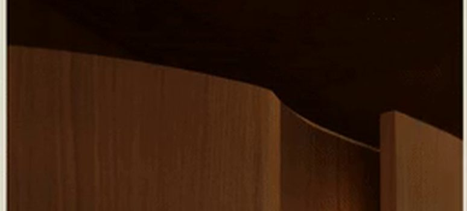

# Expanding Panels

Painéis interativos que **expandem no hover/foco**: ao apontar um card, ele
cresce e empurra/encolhe os vizinhos, a imagem de fundo dá um leve zoom, o scrim
escurece e o texto descritivo aparece de baixo pra cima. Recriação da interação
de "cards que abrem" (estilo Arc), pronta pra reutilizar.



## Características

- **Zero JS obrigatório** — a expansão é 100% CSS (`flex-grow` + `:hover`/`:focus-visible`).
- **Agnóstico de conteúdo** — imagem, título e texto vêm do markup; serve pra 2, 3 ou N painéis.
- **Tokenizado** — sobrescreva as variáveis `--xp-*` pra adotar qualquer tema. Por padrão herda `--txt`, `--warm` e `--accent` do host quando existirem.
- **Acessível** — navegável por teclado (Tab abre o card em foco), `aria-label`, respeita `prefers-reduced-motion`.
- **Responsivo** — empilha na vertical no mobile e mostra os textos sem depender de hover.
- **Portável** — use como classe CSS, helper JS de string, ou Custom Element `<expanding-panels>`.

## Arquivos

| Arquivo | Papel |
|---|---|
| `expanding-panels.css` | O componente (obrigatório). Inclua uma vez. |
| `expanding-panels.js` | Opcional: helper `expandingPanels()` + Custom Element. |
| `demo.html` | Exemplo vivo (tema warm + variante com a paleta do host). |
| `assets/wood.jpg`, `assets/room.jpg` | Imagens de exemplo. Troque pelas suas. |

## Como usar

### A) HTML puro (site ou app) — só a classe CSS

```html
<link rel="stylesheet" href="expanding-panels.css">

<div class="xp-cards xp--warm">
  <a class="xp-card" href="/estudio" style="--xp-img:url('img/madeira.jpg')" aria-label="Conheça o estúdio">
    <span class="xp-body">
      <span class="xp-title">Conheça o Estúdio
        <svg viewBox="0 0 24 24" fill="none" stroke="currentColor" stroke-width="1.4"
             stroke-linecap="round" stroke-linejoin="round" aria-hidden="true">
          <circle cx="12" cy="12" r="9"/><path d="M9 12h6M13 9l3 3-3 3"/></svg>
      </span>
      <span class="xp-desc">Conheça a linha completa de serviços da Oliveira.</span>
    </span>
  </a>
  <!-- repita <a class="xp-card"> ... para os demais painéis -->
</div>
```

- Card com link → use `<a href>`. Sem link (só ação JS) → use `<button type="button">`.
- A imagem de fundo é passada em `style="--xp-img:url('...')"`.

### B) App em template string (ex.: Sistema Oliveira / `index.html`)

Inclua o CSS no `<head>` e o JS uma vez, e gere o markup no seu render:

```html
<link rel="stylesheet" href="templates/expanding-panels/expanding-panels.css">
<script src="templates/expanding-panels/expanding-panels.js"></script>
```

```js
// dentro do seu view(), concatenando na string de innerHTML:
const html = expandingPanels([
  { title:'Projetos',   href:'#projetos',   img:'img/proj.jpg',  desc:'Orçamentos, prazos e etapas.' },
  { title:'Equipe',     href:'#equipe',     img:'img/eq.jpg',    desc:'Pessoas, funções e alocação.' },
  { title:'Financeiro', href:'#financeiro', img:'img/fin.jpg',   desc:'Fluxo de caixa e indicadores.' }
], { style:'--xp-height:340px' });   // opções: { theme:'warm', className, style }
```

O helper já escapa o conteúdo e injeta a seta. Ele adota automaticamente as
variáveis de tema do app (`--accent`, `--txt`, `--warm`).

### C) Custom Element (drop-in em qualquer lugar)

```html
<script src="expanding-panels.js"></script>

<expanding-panels theme="warm" items='[
  {"title":"Conheça o Estúdio","href":"/estudio","img":"img/madeira.jpg","desc":"Nossos serviços."},
  {"title":"Visite o Showroom","href":"/showroom","img":"img/sala.jpg","desc":"Agende uma visita."}
]'></expanding-panels>
```

Injeta o CSS sozinho (use `no-style` pra desligar, ou `css="/caminho/expanding-panels.css"`).
Renderiza em light DOM, então herda o tema da página.

### D) React / Vue / etc.

O componente é só markup + CSS. Importe `expanding-panels.css` uma vez e renderize
a mesma estrutura de `.xp-cards` / `.xp-card`. Em React, passe a imagem via
`style={{ '--xp-img': \`url(\${img})\` }}`.

## Personalização (tokens)

Defina no `.xp-cards` (inline `style` ou uma classe de tema):

| Token | Padrão | O quê |
|---|---|---|
| `--xp-height` | `440px` | Altura do grupo (no desktop). |
| `--xp-gap` | `20px` | Espaço entre painéis. |
| `--xp-radius` | `22px` | Arredondamento. |
| `--xp-grow` | `1.75` | Fator de expansão do card em foco. |
| `--xp-shrink` | `.72` | Fator dos demais cards. |
| `--xp-dur` | `.75s` | Duração da transição. |
| `--xp-text` | `--txt` do host | Cor do título. |
| `--xp-text-dim` | `--warm` do host | Cor do texto descritivo. |
| `--xp-card-bg` | `#3a2f22` | Fundo enquanto a imagem carrega. |
| `--xp-focus` | `--accent` do host | Cor do anel de foco (teclado). |

Tema pronto: adicione a classe `xp--warm` para o look cream + madeira original.

---

## Descrição pronta pra colar em prompt

> **Componente "Expanding Panels".** Um grupo de painéis retangulares lado a lado
> (2, 3 ou mais), cada um com uma imagem de fundo, um título com uma seta circular
> e um texto curto. Ao passar o mouse (ou focar por teclado) em um painel, ele
> **expande horizontalmente** enquanto os outros **encolhem**, a imagem de fundo dá
> um leve **zoom**, um gradiente escuro na base intensifica pra dar legibilidade e o
> **texto descritivo aparece** com fade de baixo pra cima. Transições suaves
> (~0,75s, easing cubic-bezier). Cantos arredondados, texto claro sobre a imagem.
> No mobile os painéis empilham na vertical e mostram o texto sem hover. É
> acessível (Tab, aria-label, prefers-reduced-motion) e tematizável por variáveis
> CSS `--xp-*`. Base: `templates/expanding-panels/` (`expanding-panels.css` +
> `expanding-panels.js`), classe `.xp-cards` > `.xp-card`.
